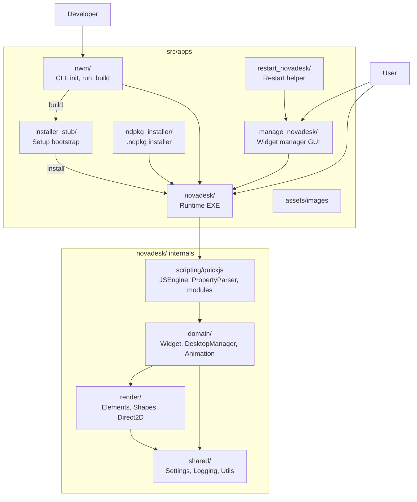

  
   
  
  
  
   
  
  
  
  

Novadesk is a open source powerful desktop widget platform built with C++. It allows users to create system monitors, custom interfaces, and desktop enhancements using familiar JavaScript syntax.

## 🔗 Resources

- 🌐 [Official Website](https://novadesk.pages.dev) - Learn more about Novadesk features and updates.
- 📚 [Documentation](https://novadesk-docs.pages.dev) - Detailed guides on creating widgets and using the platform.

## ❤️ Support / Donate

If you enjoy using Novadesk and want to support its development, consider becoming a patron:

- ☕ [Patreon](https://www.patreon.com/c/officialnovadesk) - Support the project's growth and get exclusive updates.

## Novadesk Ecosystem

Full diagrams (all `src/apps` apps, `novadesk/` layers, render class tree, and data flow): **[src/apps/ARCHITECTURE.md](src/apps/ARCHITECTURE.md)**

