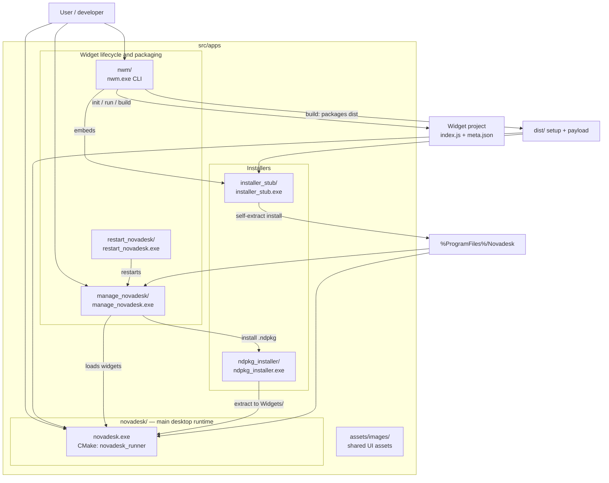
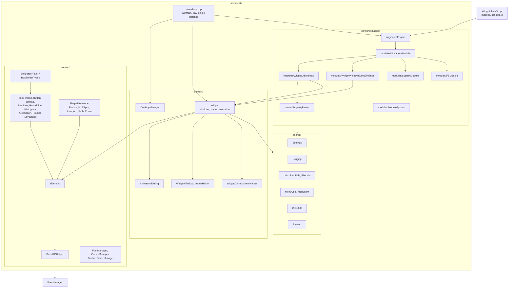
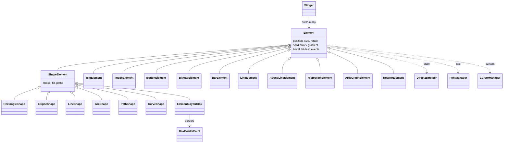
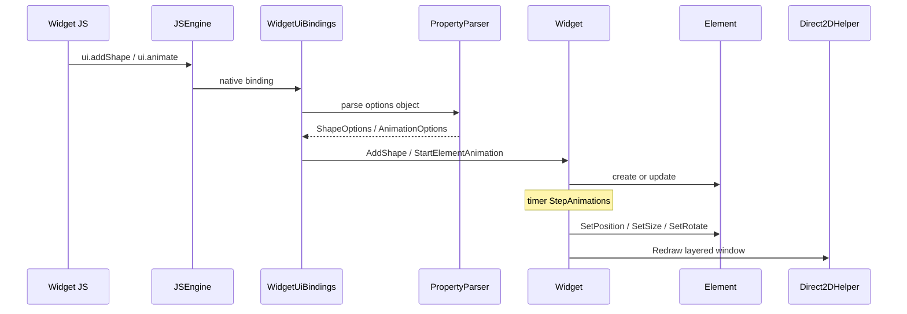
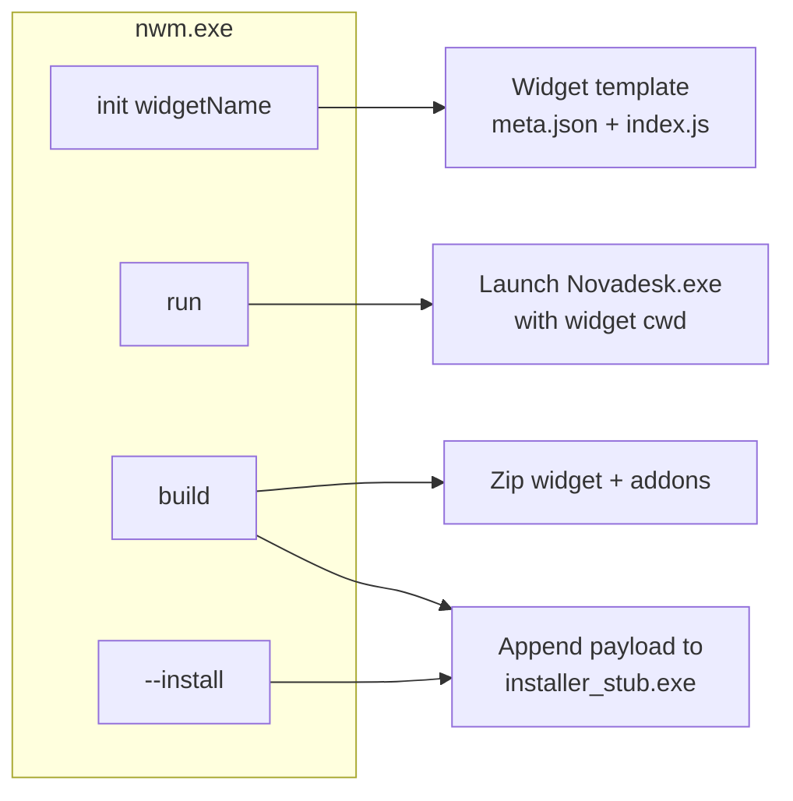

# Novadesk `src/apps` architecture

Mermaid diagrams for everything under [`src/apps`](.). View in GitHub, VS Code (Mermaid preview), or [mermaid.live](https://mermaid.live).

## 1. Applications and tooling (`src/apps`)

| Path | Role |
|------|------|
| [`novadesk/`](novadesk/) | Core widget runtime: layered windows, Direct2D UI, QuickJS scripting |
| [`nwm/`](nwm/) | CLI: `init`, `run`, `build`, `--install`; builds `.ndpkg` / setup using `installer_stub` |
| [`manage_novadesk/`](manage_novadesk/) | GUI manager: list/load widgets, tray integration |
| [`restart_novadesk/`](restart_novadesk/) | Helper to restart the manager process |
| [`ndpkg_installer/`](ndpkg_installer/) | GUI installer for `.ndpkg` widget packages |
| [`installer_stub/`](installer_stub/) | Small bootstrap EXE; payload appended by `nwm build` |
| [`assets/`](assets/) | Images used by manager/installer UIs |

> Build output under `src/apps/x64/` is generated by MSVC projects and is not part of the source layout.

---

## 2. `novadesk/` — layer overview

---

## 3. `novadesk/render/` — element and shape tree

---

## 4. Script → screen data flow

---

## 5. `nwm` CLI commands

---

## Source file index (by folder)

### `novadesk/domain/`
`Novadesk.cpp`, `DesktopManager.cpp`, `Widget.cpp`, `AnimationEasing.cpp`, `WidgetWindowChromeHelper.cpp`, `WidgetContextMenuHelper.cpp`

### `novadesk/scripting/quickjs/`
- **engine:** `JSEngine.cpp`
- **parser:** `PropertyParser.cpp`
- **modules:** `NovadeskModule.cpp`, `WidgetUiBindings.cpp`, `WidgetWindowEventBindings.cpp`, `SystemModule.cpp`, `FSModule.cpp`, `ModuleSystem.cpp`

### `novadesk/render/`
`Element`, `ShapeElement`, layout/border (`ElementLayoutBox`, `BoxBorderPaint`), primitives (`RectangleShape`, `EllipseShape`, `LineShape`, `ArcShape`, `PathShape`, `CurveShape`), widgets (`TextElement`, `ImageElement`, `ButtonElement`, `BitmapElement`, `BarElement`, `LineElement`, `RoundLineElement`, `HistogramElement`, `AreaGraphElement`, `RotatorElement`), helpers (`Direct2DHelper`, `FontManager`, `CursorManager`, `Tooltip`, `GeneralImage`)

### `novadesk/shared/`
`Settings`, `Logging`, `Utils`, `PathUtils`, `FileUtils`, `MenuUtils`, `MenuItem`, `ColorUtil`, `System`

### Other apps
- **nwm:** `src/main.cpp`, `src/rescle.cc`
- **manage_novadesk:** `main.cpp`
- **restart_novadesk:** `main.cpp`
- **ndpkg_installer:** `main.cpp`
- **installer_stub:** `src/installer_stub.cpp`
